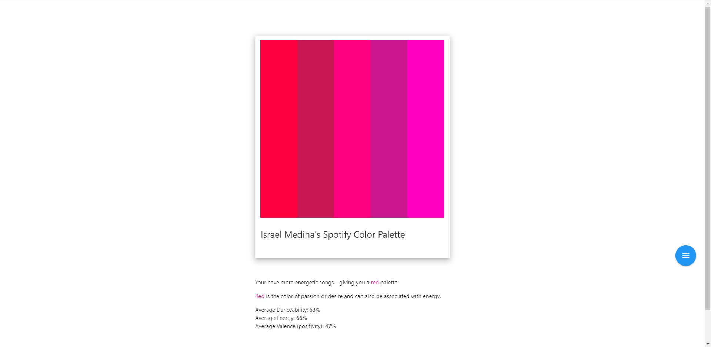
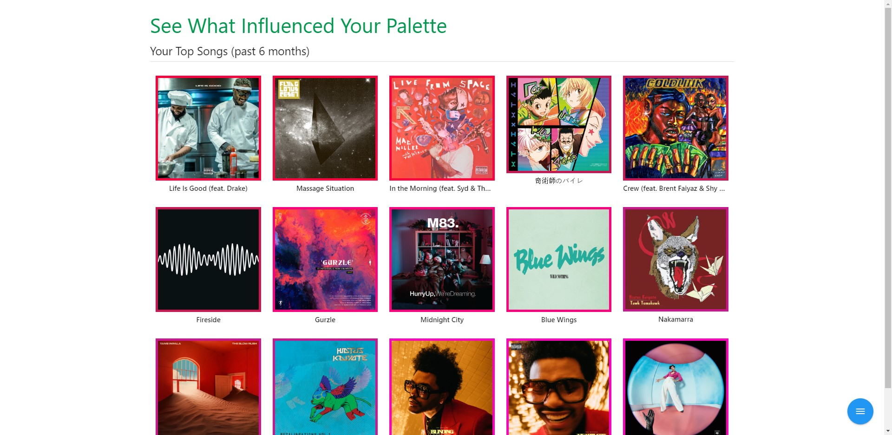
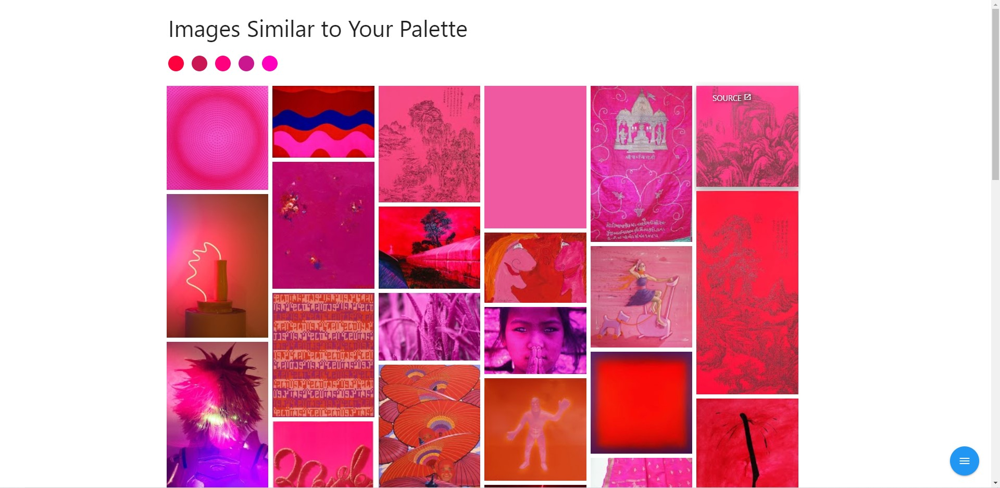

# [Spotify Palette](https://www.spotifypalette.com/) &middot; Created By Israel Medina

Spotify Palette is a website that looks at a users top tracks and generates a color palette based on their listening history over the last six months. The algorithm takes into account each songs danceability, valence, and energy. Users can also view their top 15 songs and see beautiful images that are similar to their palette from Google's Art and Culture database. 

Here are the three sections that users can view on the [website](https://www.spotifypalette.com).

---

## Landing Page

The landing page will show the user their color palette as well as why they received that palette and what it means. Hovering over each color will also display its unique color hex code. 

## Top Songs

This section of the site will display a users top 15 tracks that were pulled from the Spotify API and helped generate a palette. A total of 50 songs were gathered, each ones adding to an overall average of valence, energy, and daceability. Clicking on the album art will play the song on Spotify. 

## Similar Images

My favorite section, and one I had the most fun working on, was the "Similar Images" portion. Each user has a palette that contains 5 colors. Each colors hex code is then sent to the Google's Art and Culture [website](https://artsandculture.google.com/). Using "puppeteer", I then scrape the results image and the source to said image. The image data is sent to the front end and illustrated to the user in a photo grid form. Hovering over each image will allow you to click on the image source. 

## Technologies

Spotify Palette is a Full Stack Web App with the Spotify API.

### Back End

* Express server to handle the routes and OAuth. 

* [Puppeteer](https://github.com/puppeteer/puppeteer) to web scrape Google's Art and Culture. 

* OAuth for Spotify.

### Front End

* [Materialize.css](https://materializecss.com/) for their grid and also easy to use navigation as well as Icons. 

* [Animate.css](https://animate.style/) to bring the page to life with simple animations. 

* Huge thanks to [Adobe Color Wheel](https://color.adobe.com/create) for illustrating beautiful color palettes in various settings. I was able to construct an algorithm to recreate a look similar to their analogous palette when you first land there. 

* [Tinycolor.js](https://github.com/bgrins/TinyColor) also played a very big role in finding adjacent colors on the color wheel to make an analogous color palette. Definitely check that out for all your color needs. 

* HTML5 - CSS3 - JavaScript

### Special Thanks

* [musicScapes](https://musicscapes.herokuapp.com/) for the inspiration on using Spotify API to generate eye catching data. [Read More](https://developer.spotify.com/community/showcase/musicscape/)

### Deployment 

Spotify Palette has been deployed on Heroku with the domain registered under Google Domains. Heroku has also provided an SSL Certificate allowing for even more security when accessing the site. 

## Contributors

* Israel Medina [Github](https://github.com/medinaisrael-17) | [LinkedIn](https://www.linkedin.com/in/israel-medina-271344180/) | [Portfolio](https://israelmedina.dev)